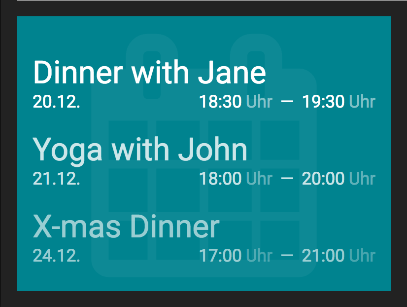

# Calendar Widget



## config options:

- multiple CalDAV URIs (the widget currently understands only specific calendar URIs, not URIs to whole CalDAV accounts)
- a username to access all the CalDAV URIs
- a password to access all the CalDAV URIs
- number of upcoming events the widget should display

## CLI usage

The `calendar.rb` can be called via the command line with

```
ruby calendar.rb PASSWORD
```